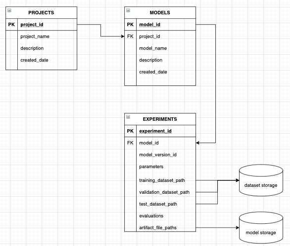
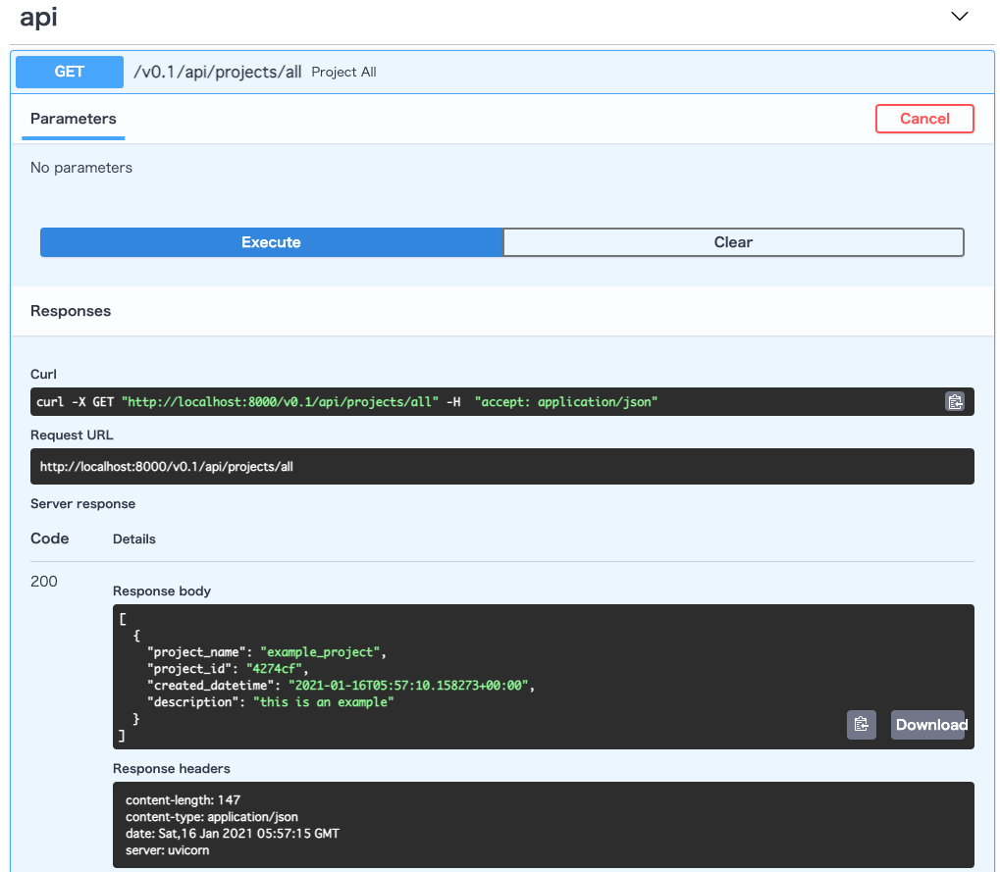

# モデル管理DB

## 目的

モデルを管理するためのデータベースおよびサービス用REST APIを構築します。
本プログラムでは以下のような構成のモデル管理サービスを作ります。



## 前提

- Python 3.8以上
- Docker
- Docker compose

## 使い方

0. カレントディレクトリ

```sh
$ pwd
~/ml-system-in-actions/chapter2_training/model_db
```

1. モデルDBサービス（REST API）用のDockerイメージのビルド

```sh
$ make build
# 実行されるコマンド
# docker build \
#     -t shibui/ml-system-in-actions:model_db_0.0.1 \
#     -f Dockerfile \
#     .
# 出力は省略
# dockerイメージとしてshibui/ml-system-in-actions:model_db_0.0.1がビルドされます。
```

2. Docker composeによるモデルDBの起動

```sh
$ make c_up
# 実行されるコマンド
# docker-compose \
#     -f ./docker-compose.yml \
#     up -d
```

3. モデルDBサービスの起動確認

10秒ほどで起動します。
`localhost:8000/docs` をブラウザで開き、Swaggerが起動していることを確認します。



4. モデルDBサービスを停止

```sh
$ make c_down
# 実行されるコマンド
# docker-compose \
#     -f ./docker-compose.yml \
#     down
```
