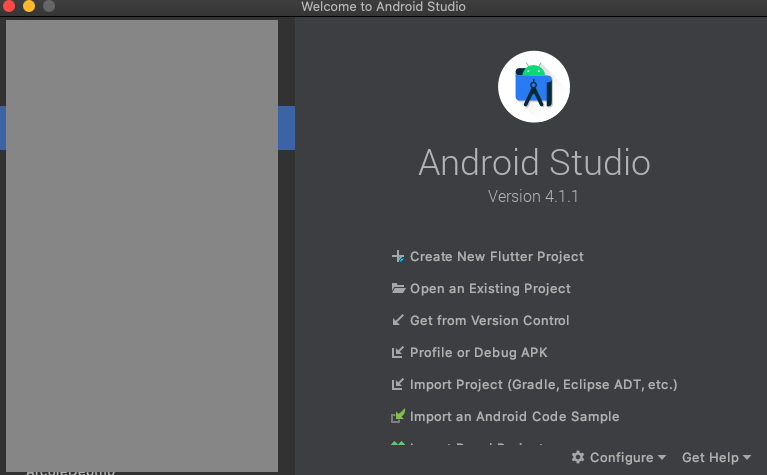
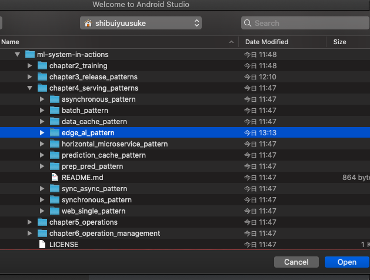
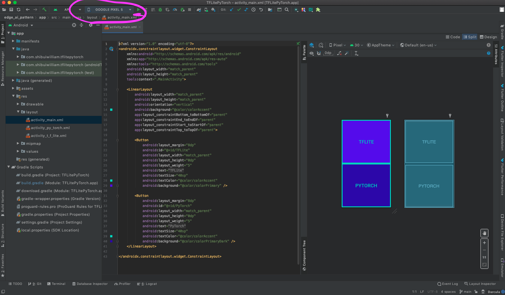
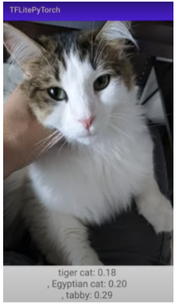

# TFLitePyTorch

## 目的

TensorflowLite および Pytorch Mobile の画像認識モデルを使い、Android でカメラに映る被写体を分類するアプリケーションを動かします。

## 前提

- Android
- Android 端末

Android Studio は以下より入手してください。

- [Android Studio](https://developer.android.com/studio/install)

# 使い方

1. Android Studio を起動し、本ディレクトリを読み込みます。

Android Studio 起動画面。

ディレクトリの選択

2. アプリケーションのインストール

Android Studio からアプリケーションを選択すると以下のような画面になります。

Android スマホを端末に接続します。
上部のエミュレータ環境で Android スマホが認識されます。
プレイボタン（▶）を押下し、アプリケーションを Android にインストールします。

3. アプリケーションを使う

